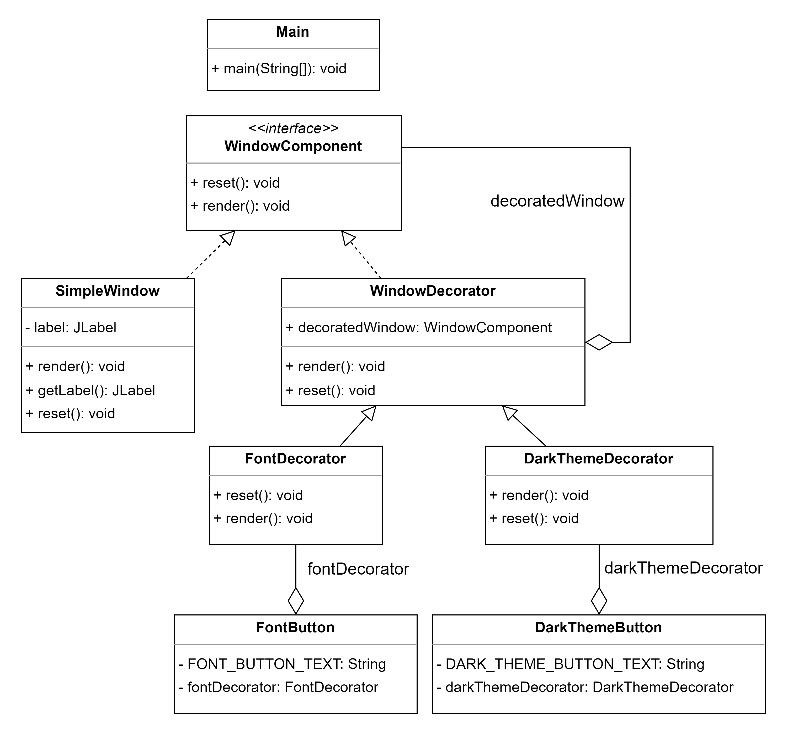

# decorator-exemple

Exemple d'implémentation du design pattern Decorator en Java.

```shell
mvn clean install
```

```shell
java -jar target/decorator-exemple-1.0-SNAPSHOT.jar
```

<div align="center">
  
</div>

https://github.com/llarboulletmarin/decorator-example/assets/63777637/339134d1-000f-4ef7-aad4-153273159a0b
